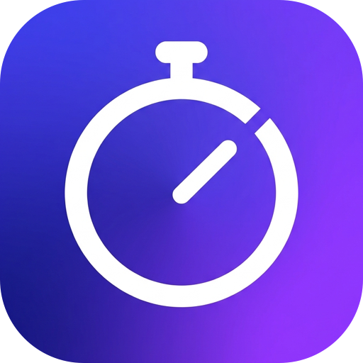
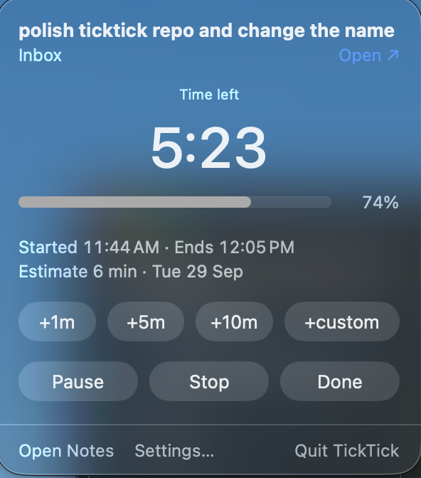
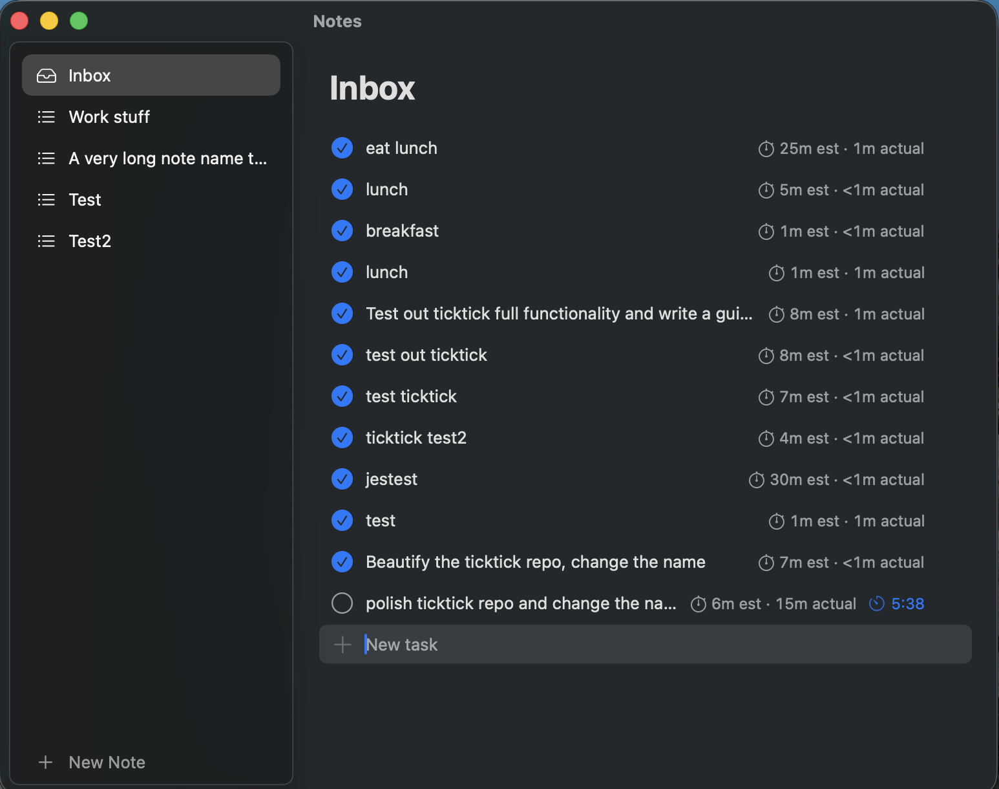

<!-- Last edited: 2026-09-29 10:55 PT -->
<a id="readme-top"></a>

[![Contributors][contributors-shield]][contributors-url]
[![Forks][forks-shield]][forks-url]
[![Stargazers][stars-shield]][stars-url]
[![Issues][issues-shield]][issues-url]

<br />
<div align="center">
  <a href="https://github.com/JacquesAttinger/TickTick">
    
  </a>

  <h3 align="center">TickTick</h3>

  <p align="center">
    A macOS menu bar timer for your tasks.
    <br />
    Type a task, give it a time, and the menu bar counts down.
    <br />
    <br />
    <a href="https://github.com/JacquesAttinger/TickTick/issues/new">Report a bug or request a feature</a>
  </p>
</div>

<details>
  <summary>Table of Contents</summary>
  <ol>
    <li>
      <a href="#about-the-project">About The Project</a>
      <ul>
        <li><a href="#built-with">Built With</a></li>
      </ul>
    </li>
    <li>
      <a href="#getting-started">Getting Started</a>
      <ul>
        <li><a href="#prerequisites">Prerequisites</a></li>
        <li><a href="#installation">Installation</a></li>
      </ul>
    </li>
    <li><a href="#usage">Usage</a></li>
    <li><a href="#development">Development</a></li>
    <li><a href="#known-limits">Known limits</a></li>
    <li><a href="#roadmap">Roadmap</a></li>
    <li><a href="#contributing">Contributing</a></li>
  </ol>
</details>

## About The Project

<p align="center">
  
</p>

<p align="center">
  
  &nbsp;&nbsp;
  
</p>

TickTick is a timeboxing to-do app for the Mac.
You write a task, you say how long it will take, and a countdown starts in the menu bar.
When the time is up, the screen flashes, a sound plays, and a notification shows.
The app also has a Notes window.
Each note is a list of tasks with checkboxes, and each task can have a timer.

The project started because the third-party "Menubar Countdown" app cannot show a task name, cannot flash the screen, and has no to-do list.
TickTick does all three.

Main features:

- **Task name in the menu bar.** For example `⏱ Write cover letter · 24:13`.
- **Loud alarm.** A white flash on every display, a sound, and a notification with Done, +5 min, and Stop buttons.
- **Overtime.** After zero, the menu bar turns red and counts up until you press Done, +5 min, or Stop.
- **Global quick-add.** Press ⌃⌥Space in any app to add a task and start its timer.
- **Notes.** Task lists with drag to reorder and a badge that compares the estimate with the real time.
- **Sleep safe.** The timer follows the real clock, so a timer that ends while the Mac sleeps fires when the Mac wakes.
- **Local only.** Your data stays on your Mac.

The full product and build plan is in [`docs/planning.md`](docs/planning.md).

<p align="right">(<a href="#readme-top">back to top</a>)</p>

### Built With

* [![Swift][Swift-badge]][Swift-url]
* [![SwiftUI][SwiftUI-badge]][SwiftUI-url]
* [![Xcode][Xcode-badge]][Xcode-url]
* [KeyboardShortcuts](https://github.com/sindresorhus/KeyboardShortcuts) for the global hotkeys
* [XcodeGen](https://github.com/yonaskolb/XcodeGen), [SwiftLint](https://github.com/realm/SwiftLint), and [SwiftFormat](https://github.com/nicklockwood/SwiftFormat) for the project file and code style

The app also uses SwiftData for storage, and AppKit for the menu bar item, the popover, and the flash windows.

<p align="right">(<a href="#readme-top">back to top</a>)</p>

## Getting Started

TickTick has no download yet.
You build it from source and copy it to `/Applications`.

### Prerequisites

- macOS 26 or later, with Xcode installed at `/Applications/Xcode.app`.
- [Homebrew](https://brew.sh).
- Point the command-line tools at Xcode one time (this needs `sudo`):

  ```sh
  sudo xcode-select -s /Applications/Xcode.app/Contents/Developer
  ```

  If `xcode-select -p` shows `/Library/Developer/CommandLineTools`, `xcodebuild` fails and SwiftLint crashes.

### Installation

1. Clone the repo.
   ```sh
   git clone https://github.com/JacquesAttinger/TickTick.git
   cd TickTick
   ```
2. Install the tools and the pre-commit hook (one time).
   ```sh
   scripts/setup.sh
   ```
   The script installs `xcodegen`, `swiftlint`, and `swiftformat` with Homebrew.
   It also sets `core.hooksPath` to `.githooks`, so the pre-commit hook runs on every commit.
3. Build the app, copy it to `/Applications`, and open it.
   ```sh
   make install
   ```
4. If the build fails on signing, set your own team in `project.yml` (`DEVELOPMENT_TEAM`).

To update later, pull the new code and run `make install` again.
The app does not update itself.

<p align="right">(<a href="#readme-top">back to top</a>)</p>

## Usage

A `⏱` icon shows in the menu bar.
The app has no Dock icon until you open the Notes window.

**Add a task and start a timer**

1. Press ⌃⌥Space from any app.
2. Type the task name and press Return.
3. In "How long?", type a time and press Return. The timer starts.
4. Press Esc instead to save the task with no timer.

Quick-add saves the task in the Inbox note.

**Time formats:** `25` is 25 minutes. `90m`, `1h`, `1h30`, and `1:30` also work.

**The popover.**
Click the menu bar item, or press ⌃⌥T, to open it.
It shows the time left and has +1m, +5m, +10m, +custom, Pause/Resume, Stop, and Done buttons.
While it is open: Space pauses or resumes, D is Done, S is Stop, and 1, 5, and 0 add 1, 5, and 10 minutes.

**Notes window.**
Open it with "Open Notes" in the popover.
The ▶ button on a task starts a timer for it.
⌘N makes a new note, ⌘Return starts a timer on the selected task, and ⇧⌘C checks the selected task.

**Settings.**
Open them with "Settings…" in the popover.
You can turn each hotkey on or off, record other keys for it, and turn on launch at login.
The Help tab explains each feature and lists every shortcut.

<p align="right">(<a href="#readme-top">back to top</a>)</p>

## Development

| Target | What it does |
|---|---|
| `make gen` | Generates `TickTick.xcodeproj` from `project.yml` with XcodeGen. The project file is not committed. |
| `make build` | Generates the project, then builds the Debug app into `build/`. |
| `make test` | Generates the project, then runs the `TickTickTests` unit tests. |
| `make lint` | Runs `swiftlint lint --strict` and `swiftformat --lint .`. |
| `make format` | Runs `swiftformat .` to fix formatting in place. |
| `make install` | Builds Release, quits a running TickTick, copies the app to `/Applications`, and opens it. |

`build`, `test`, and `install` run `make gen` first, so new files under `TickTick/` or `TickTickTests/` are always part of the build.

To keep your real tasks out of a test run, start the app with a throwaway store:

```sh
open build/Build/Products/Debug/TickTick.app --args -debugStorePath /tmp/ticktick-test/TickTick.store
```

Code rules:

- Every Swift file starts with `// Last edited: YYYY-MM-DD HH:MM PT`.
- No file has more than 500 lines, and no function body has more than 75 lines. SwiftLint enforces both.
- The pre-commit hook runs SwiftFormat (lint mode) and SwiftLint (strict) on the staged Swift files.
  Never skip it with `git commit --no-verify`.

<p align="right">(<a href="#readme-top">back to top</a>)</p>

## Known limits

- **No Time Sensitive notifications.**
  The app is signed with a personal (free) development team, and personal teams cannot sign the `com.apple.developer.usernotifications.time-sensitive` entitlement.
  So `TickTick.entitlements` leaves that key out, and the timer notifications use the `.active` interruption level.
  A Focus mode can hide these notifications, but the flash and the sound still work.
  To get Time Sensitive notifications, sign with a paid Apple Developer team and add the key back.

<p align="right">(<a href="#readme-top">back to top</a>)</p>

## Roadmap

- [x] Menu bar timer, popover, and alarm
- [x] Global quick-add hotkey
- [x] Notes window with tasks, drag to reorder, and time badges
- [x] Settings, launch at login, and keyboard shortcuts
- [ ] Help tab in Settings
- [ ] Full visual check and polish pass

See the [open issues](https://github.com/JacquesAttinger/TickTick/issues) for more, and [`docs/planning.md`](docs/planning.md) for the full plan.

<p align="right">(<a href="#readme-top">back to top</a>)</p>

## Contributing

Suggestions and fixes are welcome.

1. Open an issue first if the change is big, so we can agree on it.
2. Fork the project.
3. Create your branch (`git checkout -b feature/my-change`).
4. Run `scripts/setup.sh`, so the pre-commit hook runs on your commits.
5. Commit your changes, and run `make test` and `make lint`.
6. Push the branch and open a pull request.

<p align="right">(<a href="#readme-top">back to top</a>)</p>

[contributors-shield]: https://img.shields.io/github/contributors/JacquesAttinger/TickTick.svg?style=for-the-badge
[contributors-url]: https://github.com/JacquesAttinger/TickTick/graphs/contributors
[forks-shield]: https://img.shields.io/github/forks/JacquesAttinger/TickTick.svg?style=for-the-badge
[forks-url]: https://github.com/JacquesAttinger/TickTick/network/members
[stars-shield]: https://img.shields.io/github/stars/JacquesAttinger/TickTick.svg?style=for-the-badge
[stars-url]: https://github.com/JacquesAttinger/TickTick/stargazers
[issues-shield]: https://img.shields.io/github/issues/JacquesAttinger/TickTick.svg?style=for-the-badge
[issues-url]: https://github.com/JacquesAttinger/TickTick/issues
[Swift-badge]: https://img.shields.io/badge/Swift_6-F05138?style=for-the-badge&logo=swift&logoColor=white
[Swift-url]: https://www.swift.org
[SwiftUI-badge]: https://img.shields.io/badge/SwiftUI-0A84FF?style=for-the-badge&logo=swift&logoColor=white
[SwiftUI-url]: https://developer.apple.com/xcode/swiftui/
[Xcode-badge]: https://img.shields.io/badge/Xcode-147EFB?style=for-the-badge&logo=xcode&logoColor=white
[Xcode-url]: https://developer.apple.com/xcode/
